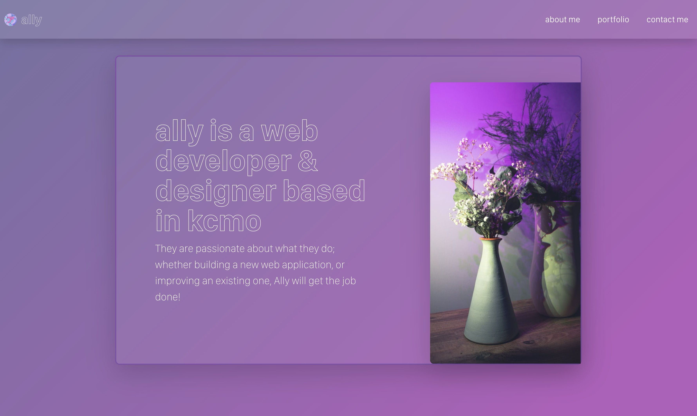

# React Developer Webpage

## Deployment
App is deployed via netlify [here](https://ally-developer-portfolio.netlify.app/)

## Overview

This is a React project that serves as a personal webpage for a software developer. It is built using React, Bootstrap, and Vite.

## Demo

## Features

* A navigation bar with links to About Me, Portfolio, Contact, and Resume sections
* An About Me section with a photo and bio
* A Portfolio section with links to six applications and their corresponding GitHub repositories
* A Contact section with a contact form
* A Resume section with a link to a downloadable resume

## Technologies Used

* React
* Bootstrap
* Vite
* JavaScript
* HTML
* CSS

## License

This project is licensed under the MIT License.
